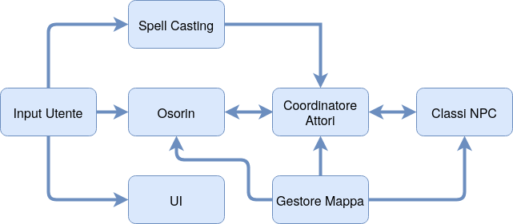

# The heir of Lyskar

Al momento per il motore di gioco sono identificabili dei macrogruppi come listato di seguito.
- Gestore degli input utente
- Giocatore (Osorin: movimento, azioni base, ecc.)
- Sistema di casting (da tastiera, mouse, gamepad)
- User Interface (UI) che comprende la finestra di dialogo gestita da utente
- Coordinatore degli attori (quando osorin lancia una magia, il coordinatore informa gli oggetti colpiti)
- Classi NPC (nemici, animali, pericoli ambientali, enigmi, personaggi statici, ecc.)
- Gestore delle sezioni di mappa (che contengono oggetti interagibili, nemici, personaggi, ecc.)

Work in progress...